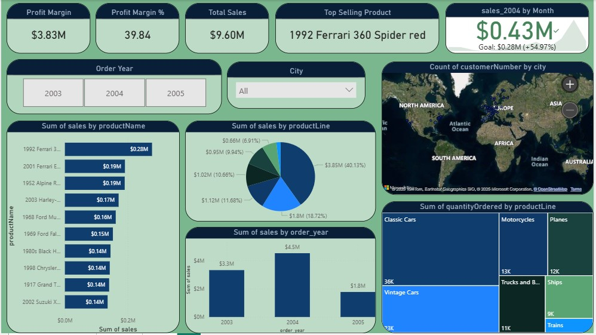

# Classic Models Power BI Dashboard

## 📊 Overview
This project is a **Power BI dashboard** built using the **Classic Models** dataset.  
It visualizes key business metrics such as:
- Total sales by product line
- Revenue by country and region
- Top customers by sales
- Monthly sales trends

The goal is to provide **clear and interactive insights** for better decision-making.

---
## 🗂 Project Structure
classic_models_powerbi/
│-- classicmodels.pbix # Main Power BI file
│-- classic_models_dataset/ # Data source files
│-- README.md # Project documentation

---

## 🚀 How to Use
1. **Download the `.pbix` file** from this repository.
2. Open it in **Power BI Desktop**.
3. If required, update the data source paths:
   - Go to **Home → Transform Data → Data Source Settings**
   - Update to your local file paths or database connections
4. Refresh the data and explore the dashboard.

---

## 📌 Features
- Interactive filters & slicers
- KPI cards for quick metrics
- Trend analysis using line charts
- Geographic sales mapping
- Top-performing product insights

---

## 📷 Dashboard Preview

---

## 🛠 Tools Used
- Power BI Desktop
- Microsoft Excel (for data preparation)
- Classic Models Sample Dataset

---

## 📄 License
This project is open-source under the [MIT License](LICENSE).

---

## ✨ Author
Created by Trinadh Jagarlamudi(https://github.com/trinadh8247)
